# 🟢 Full-Stack Web Development Bootcamp


Welcome to the **Full-Stack Web Development Bootcamp** repository!  

This repo contains **lecture notes, exercises, and mini-projects** for a **34-day full-stack course**, covering:

- **HTML & CSS** – structure, styling, and responsive design  
- **Git** – version control and collaboration  
- **JavaScript & React** – interactive frontends  
- **Python & Django** – backend logic  
- **Wagtail CMS** – production-ready content management  

---

## 🗺 Bootcamp Roadmap


> The roadmap highlights all phases, day ranges, and major topics. Each day links to detailed notes in Markdown.

---

## 📁 Repository Structure

```
.
├── 1-Day1-Web-Dev-Fundamentals.md
├── 2-Day2-HTML-Deep_Dive.md
├── 3-Day5-CSS-Mastery.md
├── 4-Day8-Git-Bootcamp.md
├── 5-Day10-JavaScript-Bootcamp.md
├── 6-Day15-Python-Bootcamp.md
├── 7-Day20-React-Bootcamp.md
├── 8-Day25-Django-Bootcamp.md
├── 9-Day30-Wagtail-Bootcamp.md
├── ROADMAP.md
├── assets/bootcamp-timeline.png
└── README.md

```

- Each Markdown file contains **lecture notes, exercises, and mini-projects** for that day.  
- `ROADMAP.md` provides a **text-based roadmap** with all 34 days.  
- `assets/bootcamp-timeline.png` is the visual timeline for the full course.

---

## 📝 How to Use

1. Start with the [ROADMAP](./ROADMAP.md) to see the full course structure.  
2. Follow the course **sequentially**, from Day 1 → Day 34.  
3. Practice **hands-on coding** in your local environment:  
   - HTML/CSS in the browser  
   - Python/Django in VSCode / PyCharm / Jupyter Notebook  
   - React in Node.js / Vite / Create React App  
4. Use **Git** daily to commit your work and track progress.

---

## ⚡ Mini Projects

- Interactive **To-Do List** (JS & React)  
- **Blog Manager** (Python & Django)  
- **Portfolio / CMS site** (Wagtail)  

> Each day includes **guided exercises** building toward full-stack applications.

---

## 📚 Prerequisites

- Basic computer literacy  
- Installed **Python 3.10+**, **Node.js 18+**, **VSCode**  
- Git installed  
- Familiarity with web browsers  

---

## 📌 Quick Links

- [Full Roadmap](./ROADMAP.md)  
- [Day 1 – Web Dev Fundamentals](./1-Day1-Web-Dev-Fundamentals.md)  
- [Days 2–4 – HTML Deep Dive](./2-Day2-HTML-Deep_Dive.md)  
- [Days 5–7 – CSS Mastery](./3-Day5-CSS-Mastery.md)  
- [Days 8–9 – Git Bootcamp](./4-Day8-Git-Bootcamp.md)  
- [Days 10–14 – JavaScript Bootcamp](./5-Day10-JavaScript-Bootcamp.md)  
- [Days 15–19 – Python Bootcamp](./6-Day15-Python-Bootcamp.md)  
- [Days 20–24 – React Bootcamp](./7-Day20-React-Bootcamp.md)  
- [Days 25–29 – Django Bootcamp](./8-Day25-Django-Bootcamp.md)  
- [Days 30–34 – Wagtail Bootcamp](./9-Day30-Wagtail-Bootcamp.md)  

---

## 🌟 Contributing

- Fix typos, improve examples, or add notes  
- Open a Pull Request, keeping changes **modular**  
- Maintain consistency with the course structure  

---

## 📄 License

MIT License – use freely for **personal learning or teaching purposes**.

---

> Build, experiment, and grow as a **full-stack web developer**.  
> Your 34-day journey starts here!
```

---

# 🟢 Visual 34-Day Bootcamp Timeline (Mermaid)

```mermaid
%% 34-Day Full-Stack Bootcamp Timeline
gantt
    title Full-Stack Web Dev Bootcamp (34 Days)
    dateFormat  YYYY-MM-DD
    axisFormat  %d

    section Web Fundamentals
    Day 1 – Web Dev Fundamentals :done, 2026-02-01, 1d
    Days 2–4 – HTML Deep Dive     :done, 2026-02-02, 3d
    Days 5–7 – CSS Mastery        :done, 2026-02-05, 3d

    section Development Tools
    Days 8–9 – Git Bootcamp       :done, 2026-02-08, 2d

    section Frontend Programming
    Days 10–14 – JavaScript       :done, 2026-02-10, 5d
    Days 15–19 – Python           :done, 2026-02-15, 5d
    Days 20–24 – React            :done, 2026-02-20, 5d

    section Backend Development
    Days 25–29 – Django           :done, 2026-02-25, 5d
    Days 30–34 – Wagtail          :done, 2026-03-01, 5d
```




